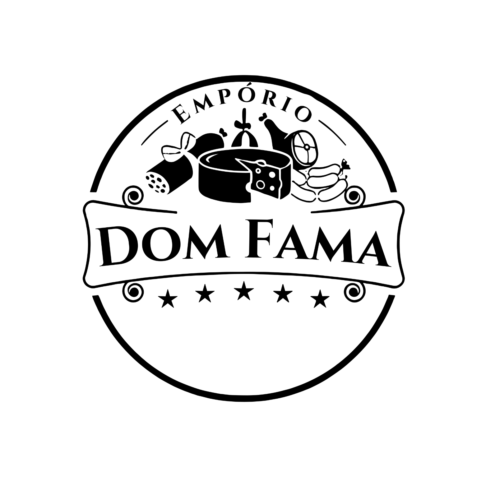

# fechamento_emporioDomFama
DOM FAMA — FRONTEND CORRIGIDO

Correções solicitadas:
1. Removido o bloco visual antigo:
   
DOM FAMA

2. Incorporada a imagem enviada:
   

3. Removido do frontend:
   - Campo "URL base do n8n"
   - Campo "Token WBuy opcional"

4. Agora o frontend usa fixo no código:
   const API_BASE = "https://emporio-chat-n8n.fn9pf1.easypanel.host/webhook";
   const TOKEN_WBUY_PADRAO = "MjlkNzFiMzEtNWJiYS00YzZjLWE5ZjItNjRiZmYxODMzYjVmOjQ2NTgyZWRkOTg2YTRmYTM4MDAzN2QxMmI1Y2U1NWE4";

5. Workflow n8n também mantém TOKEN_PADRAO como fallback interno.

IMPORTANTE:
- Antes de subir no GitHub/VPS, abra o index.html e confirme se API_BASE está apontando para o domínio certo do seu n8n.
- Se quiser esconder melhor o endpoint, use proxy Nginx depois.
